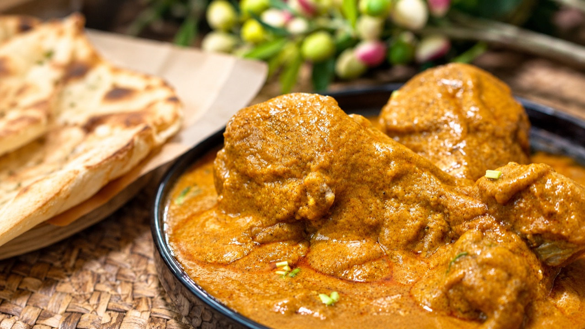
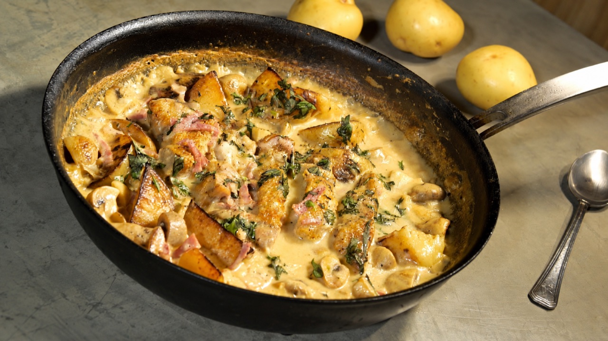
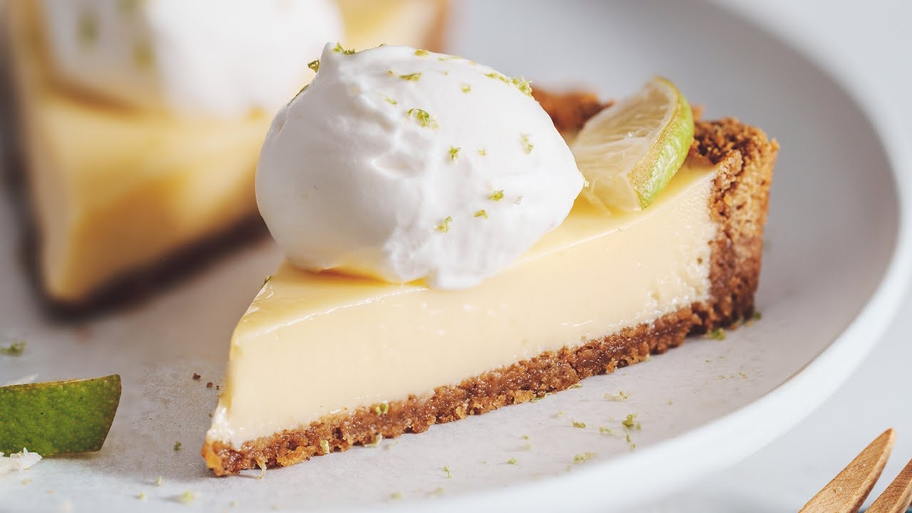

<div align="center">

<picture>
  <source media="(prefers-color-scheme: dark)" srcset="assets/logo-dark.png">
  
</picture>

### Turn any recipe into a ready-to-generate AI video.

**CookCut** is a Claude skill that turns a reference photo + a recipe, DIY guide or tutorial into multi-clip AI video prompts for Seedance, Google Flow / Veo, Kling and more — sized to each model's real clip limit, with shots that cut together cleanly.

[](#-quick-start)
[](#-supported-models)
[](#-supported-models)
[](LICENSE)
[](https://github.com/inspiriflow/cookcut)

[Demo](#-demo) · [Quick start](#-quick-start) · [How it works](#-how-it-works) · [Supported models](#-supported-models)

</div>

---

## 🍳 What is CookCut

AI video models are good at 5–15 second shots. Recipes and tutorials are 10+ steps long. Getting from one to the other usually means hours of trial and error: guessing how long each clip can be, re-describing the same plate in every prompt, and watching the garnish change color between cuts.

CookCut does that planning for you. Give it three things:

| You provide | Example |
|---|---|
| 📸 **Reference image** of the finished result | A photo of your plated dish |
| 📋 **Step-by-step source** | Recipe text, a URL, a PDF, an assembly manual, a craft tutorial |
| ⏱️ **Target length + model** | "30 seconds, Seedance 2.0" |

You get back a clip-by-clip script, ready to paste into your video model or send to it directly.

## ✨ Why CookCut

- **Checks real limits, not stale ones.** Looks up the chosen model's current max clip length online before planning, so a 30s video becomes 2 × 15s on Seedance 2.0 and 8 + 8 + 8 + 6 on Veo.
- **Consistent across cuts.** Builds a "continuity bible" from your reference photo — plate, surface, lighting, hands — and repeats it in every clip, so the dish looks the same from first shot to last.
- **Shows actions, not instructions.** Turns "preheat the oven, simmer 40 minutes" into visual beats a model can actually render.
- **Ends on the money shot.** The final clip always lands on a hero shot matching your reference image.
- **Model-native prompts.** Timestamped prompts for Seedance 2.5, frame-to-frame handoffs for Google Flow, shot lists for everything else.
- **Not just food.** Works for furniture assembly, crafts, LEGO builds, product how-tos — anything with steps and a finished result.

## 🎬 Demo

> ▶ Click a thumbnail to play.

<table>
  <tr>
    <th width="25%">Reference image</th>
    <th width="25%">Source</th>
    <th width="50%">CookCut output</th>
  </tr>
  <tr>
    <td></td>
    <td>Butter chicken curry<br><sub>10s clip</sub></td>
    <td><video src="https://github.com/user-attachments/assets/e256ddde-0119-439b-a67d-210c32df2d7e" controls width="100%"></video></td>
  </tr>
  <tr>
    <td></td>
    <td>Creamy chicken &amp; potato<br><sub>10s clip</sub></td>
    <td><video src="https://github.com/user-attachments/assets/ff7681ab-da03-46d1-b655-97f04fddecb5" controls width="100%"></video></td>
  </tr>
  <tr>
    <td></td>
    <td>Lime pie<br><sub>10s clip</sub></td>
    <td><video src="https://github.com/user-attachments/assets/c0490cb2-c79c-4687-ade1-f578a33def02" controls width="100%"></video></td>
  </tr>
</table>

## 🧭 How it works

```
Reference photo + recipe + length + model
        │
        ▼
1. Collect inputs      → asks only for what's missing
2. Check model limits  → live search: max clip length, allowed durations, image input, extend
3. Plan segments       → fewest clips that hit your target (scripts/plan_segments.py)
4. Continuity bible    → fixed description of plate, surface, light, hands
5. Visual beats        → steps condensed to 2–4s on-screen moments
6. Write scripts       → model-specific prompt per clip, each ending on a handoff frame
7. Deliver             → send to a connected video tool, or copy-paste scripts
```

Each clip comes out like this:

```
CLIP 1/2 — 15s — Seedance 2.0 — 9:16 — audio on
Input: image-to-video, reference image as style reference

Continuity: Tomato-egg stir-fry on a white ceramic plate, glossy red sauce,
soft yellow egg curds, chopped scallion on top. Light oak counter, warm side
light from the left, shallow depth of field. Hands only, no faces.

Shots:
0–3s   — Overhead static · two hands crack eggs into a glass bowl
3–7s   — 45° macro · chopsticks whisk eggs to a froth · slow push-in
...
Ends on: wok of soft egg curds, wooden spatula resting at right, overhead
Audio: whisking, oil sizzle, soft kitchen ambience
Avoid: faces, readable text, extra hands, plate changing color
```

## 🎥 Supported models

CookCut checks these online every run. The table is a snapshot from **October 2026**.

| Model | Max per clip | Durations | Notes |
|---|---|---|---|
| Seedance 2.0 | 15s | 4–15s (some platforms: 4, 5, 6, 8, 10, 12, 15) | Image + multi-reference input, native audio |
| Seedance 2.5 | 30s | check platform | Timestamp-level prompting, multi-round extension |
| Google Flow / Veo 3.1 | 8s | 4, 6, 8 | First/last-frame control, Extend in Flow |
| Kling, Runway, Sora, others | — | — | Looked up at runtime |

## 🚀 Quick start

**Claude.ai / Claude desktop app**

1. Download [`cookcut.skill`](https://github.com/inspiriflow/cookcut/releases/latest) from Releases.
2. Upload it in Claude's Skills settings.
3. In a new chat, type `/cookcut` or just ask: *"Turn this recipe into a 30-second Seedance video."*

**Claude Code**

```bash
git clone https://github.com/inspiriflow/cookcut.git
cp -r cookcut/cookcut ~/.claude/skills/
```

## 🧩 Using CookCut

| Input | Required | Default |
|---|---|---|
| Reference image | Yes | — |
| Step-by-step source (text / URL / PDF) | Yes | — |
| Target length | Yes | — |
| Video model | Yes | — |
| Delivery mode | Yes | Asked every run |
| Aspect ratio | No | 9:16 |
| Audio | No | Ambient SFX, no voiceover |

**Delivery modes**

- **Copy-paste scripts** — one code block per clip plus assembly notes. Works with any model, any platform.
- **Send directly** — if a video-generation connector or MCP server for your model is connected, CookCut confirms the plan and credit cost, then generates clips in order. If none is connected, it falls back to copy-paste scripts.

You'll still assemble the clips in an editor like CapCut or Premiere — CookCut gives you trim points and captions to add.

## 🏗️ Project structure

```
cookcut/
├── SKILL.md                     # The skill: workflow and rules
├── scripts/
│   └── plan_segments.py         # Splits target length into valid clip durations
└── references/
    ├── models.md                # Fallback snapshot of model limits
    └── prompt-formats.md        # Prompt shapes for Seedance, Veo/Flow, generic
assets/                          # Logo, reference images, video posters
```

Try the planner on its own:

```bash
python cookcut/scripts/plan_segments.py --total 30 --max 8 --allowed 4,6,8
# → JSON plan: 4 clips of 8 + 8 + 8 + 6 = 30s
```

## 🗺️ Roadmap

- [ ] Traditional Chinese README and caption presets
- [ ] More demo examples (crafts, assembly)
- [ ] Direct generation via hosted video APIs

## 🤝 Contributing

Issues and pull requests are welcome — especially new model limits, prompt formats, and demo examples.

## ⚖️ License

[MIT](LICENSE) © Alex Lou
